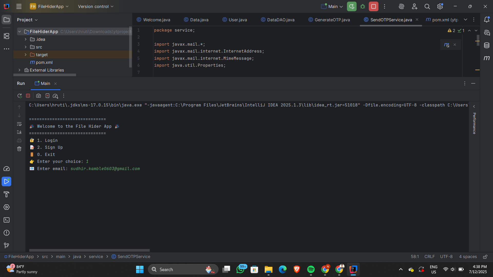
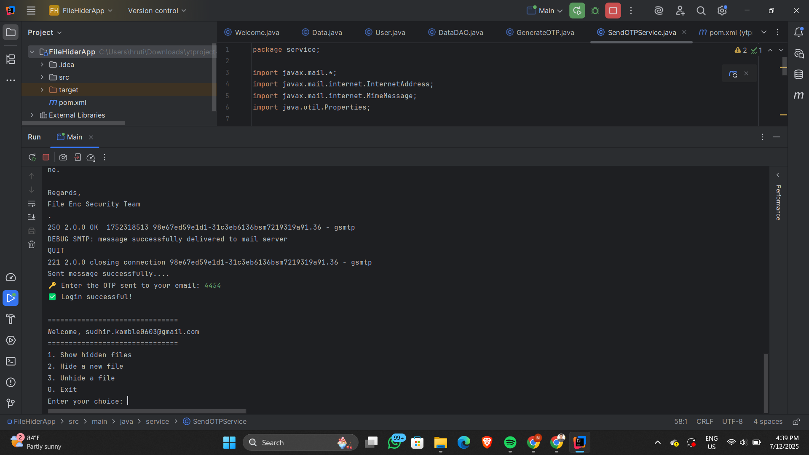
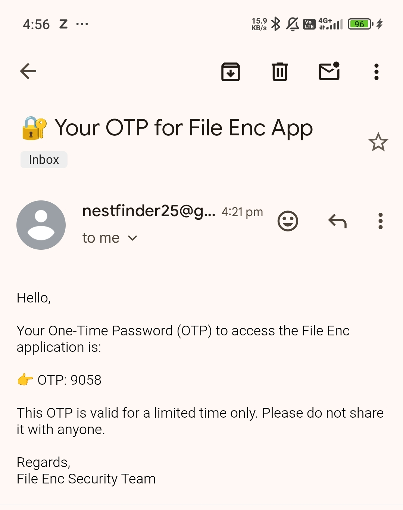
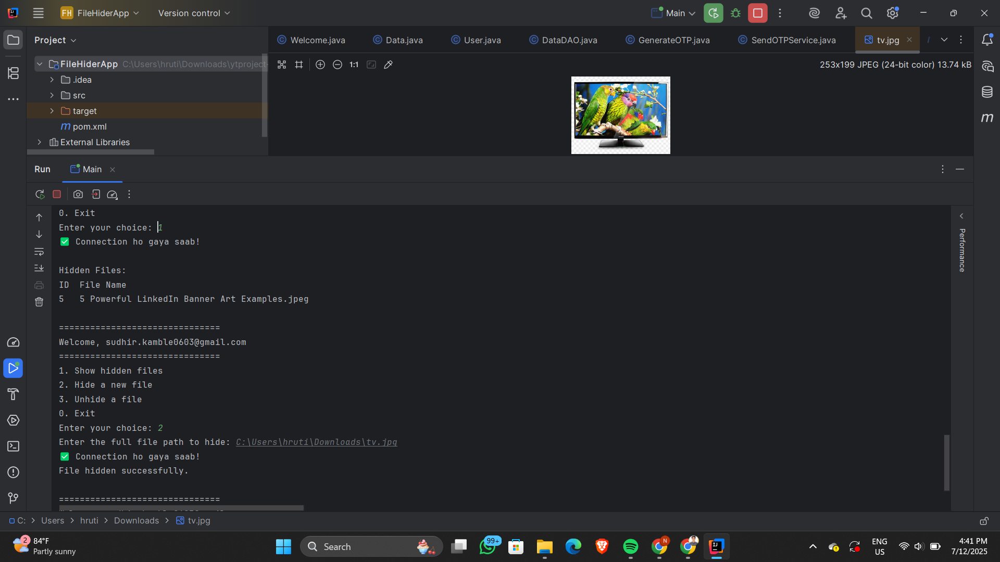
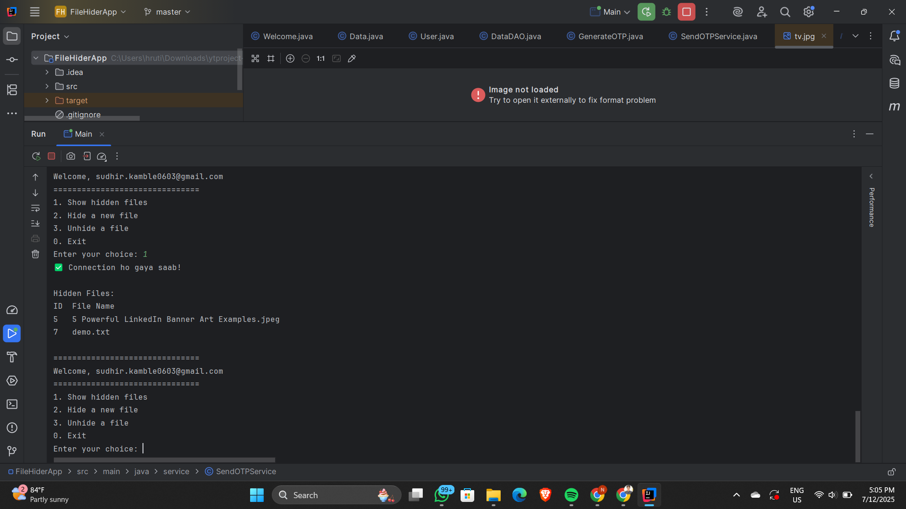
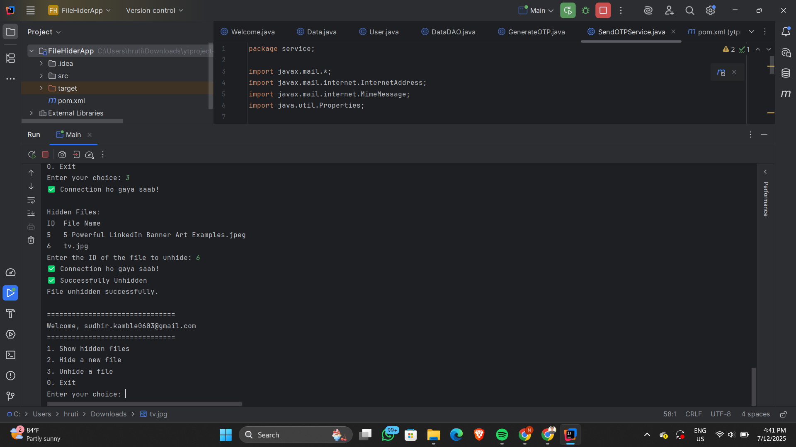

# 🔐 File Hider App

A Java-based desktop application that allows users to **hide** and **unhide** sensitive files securely using a simple login system with **OTP verification** via email.

---

## 📚 What I Learned

Through this project, I gained hands-on experience in:

- Java Core concepts: OOP, File handling, Exception handling
- Multi-class architecture with MVC pattern
- JDBC (Java Database Connectivity)
- Sending OTP via Email using JavaMail API
- Creating a user-friendly command-line interface (CLI)
- Structuring clean and modular code
- Using MySQL for data storage
- OTP generation and validation logic
- Writing reusable DAO and Service layers

---

## 🚀 Features

- 📝 User Sign-up with email verification (OTP)
- 🔐 Login with email and OTP
- 📂 Hide files (store metadata in database)
- 👀 View hidden files
- 🚫 Unhide selected files
- 🔄 Real-time feedback in CLI
- 📧 Email-based OTP system
- 💾 Persistent file details using MySQL

---

## 🛠️ Technologies Used

- Java (JDK 17)
- MySQL Database
- JDBC
- JavaMail API
- IntelliJ IDEA (or Eclipse)
- Maven (optional)

---

## 🖼️ Screenshots

> 📌 Make sure your screenshots are placed in a folder named `assets` inside your project.

| Screen | Screenshot |
|--------|------------|
| 👋 Welcome Screen |  |
| 🔐 Login with OTP |  |
| ✉️ OTP Email Received |  |
| 📂 Hide a File |  |
| 👁️ View Hidden Files |  |
| 🚫 Unhide a File |  |

---

## ▶️ How to Run

1. **Clone the Repository**  
   ```bash
   git clone https://github.com/your-username/FileHiderApp-using-Java.git
   ```

2.  **Setup Database**

Create a MySQL database (e.g., file_hider)

Add users and files tables using your own schema

Update DB credentials in DataDAO.java

3. **Run the Application**

Open project in IntelliJ or Eclipse

Run the Main class

Start hiding your secret files 😄


### 💡 Future Improvements
GUI version using JavaFX or Swing

Password-based login system

Encrypt file paths

Delete files securely

Dark mode CLI 🌑
